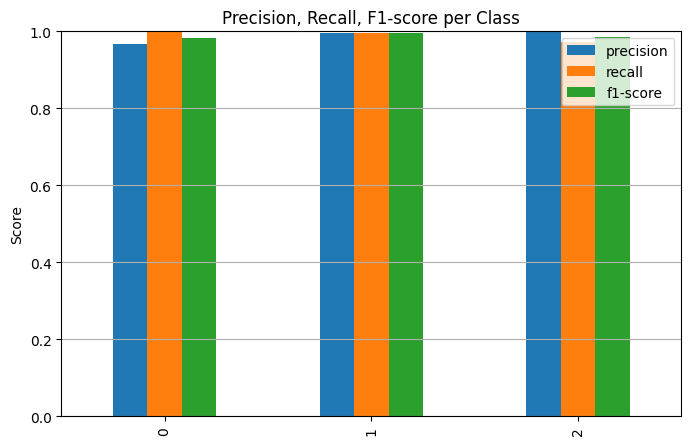
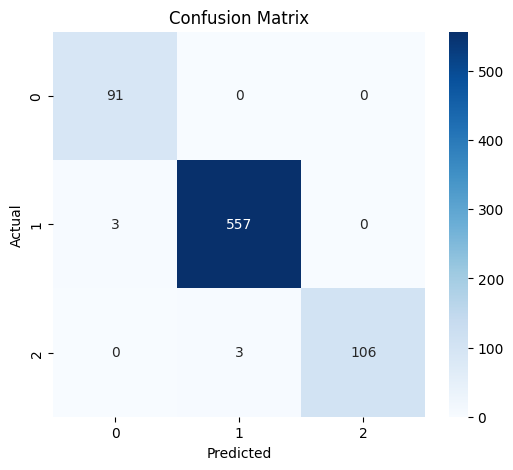
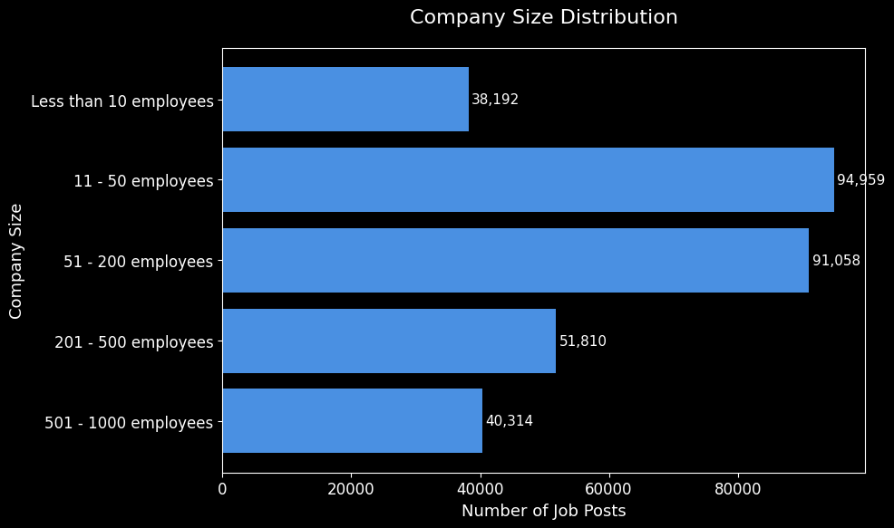

# Developer Seniority Prediction (XGBoost)

## Overview
This project predicts a developer’s **seniority level** (`Junior`, `Mid-level`, `Senior`) from job-related features (title, experience, salary, company size, province, …).  

The end-to-end pipeline:

1. **Feature extraction** from job titles (seniority, specialty, binary flags, length metrics)  
2. **Preprocessing** – imputation, scaling, one-hot encoding, log-transform of salary  
3. **Class imbalance** – **BorderlineSMOTE** (capped at 60 % of the majority class)  
4. **Model** – **XGBoostClassifier** (`multi:softprob`) tuned with **RandomizedSearchCV**  
5. **Evaluation** – accuracy 0.992, macro-F1 0.988  

---

## Model Pipeline (summary)

| Stage | Technique |
|-------|-----------|
| Title → Seniority & Specialty | Custom regex parsers |
| Binary title flags | `has_lead`, `has_manager_word`, … |
| Numerical | `SimpleImputer(median) → StandardScaler` |
| Categorical | `SimpleImputer(constant) → OneHotEncoder` |
| Imbalance | `BorderlineSMOTE` |
| Classifier | `XGBClassifier` (best hyper-params below) |
| Tuning | `RandomizedSearchCV` + `StratifiedKFold` |

**Best hyper-parameters**

```json
{
  "clf__n_estimators": 297,
  "clf__max_depth": 5,
  "clf__learning_rate": 0.1158,
  "clf__subsample": 0.6888,
  "clf__colsample_bytree": 0.5002,
  "clf__reg_alpha": 0.5107,
  "clf__reg_lambda": 0.8348
}
```

---

## Evaluation on the test set

| Metric | Value |
|--------|-------|
| **Accuracy** | **0.9921** |
| **F1 (macro)** | **0.9876** |
| **F1 (weighted)** | **0.9921** |

### Confusion Matrix

| True \ Pred | Junior | Mid-level | Senior |
|-------------|--------|-----------|--------|
| **Junior**   | **91** | 0 | 0 |
| **Mid-level**| 3 | **557** | 0 |
| **Senior**   | 0 | 3 | **106** |

---

## Feature Importance (Top 10)

| Feature Index (after OHE) | Importance |
|---------------------------|------------|
| 68 | 0.1474 |
| 8  | 0.0710 |
| 7  | 0.0610 |
| 40 | 0.0606 |
| 98 | 0.0580 |
| 93 | 0.0542 |
| 3  | 0.0506 |
| 53 | 0.0470 |
| 54 | 0.0377 |
| 45 | 0.0334 |

> *Indices refer to the transformed feature vector (one-hot columns expand the original set).*

---

## Visualisations

All plots are stored in `plots/` and automatically generated by the notebook.

| Plot | Description | File |
|------|-------------|------|
| **Precision / Recall / F1 per class** | Bar chart showing the three metrics for each seniority class. | `plots/PRF.png` |
| **Confusion matrix** | Heat-map of true vs. predicted labels. | `plots/confusionMatrix.png` |
| **Company-size distribution** | Horizontal bar chart of the five company-size buckets (number of job posts). | `plots/companySize.png` |
| **Top-10 provinces by job posts** | Vertical bar chart of the provinces with the most postings. | `plots/jobPosts.png` |








---

## Prediction Example

```python
pipeline.predict(pd.DataFrame([{
    "Title": "Senior Back-End Engineer",
    "YearsOfExperience": 8,
    "AvgSalary": 120000,
    "CompanySize": "51 - 200 employees",
    "Province": "Tehran",
    ...
}]))   # → 'Senior'
```

---

## Tech Stack

| Library | Purpose |
|---------|---------|
| `pandas`, `numpy` | Data wrangling |
| `scikit-learn` | Pipelines, preprocessing, metrics |
| `imblearn` | BorderlineSMOTE |
| `xgboost` | Gradient-boosting classifier |
| `matplotlib`, `seaborn` | Static plots |
| `joblib` | Model persistence |

---

## How to Run

```bash
git clone <repo-url>
cd developer-seniority-prediction
pip install -r requirements.txt
jupyter notebook Developer_Seniority_Prediction.ipynb
```

*The notebook will*:

1. Load `developers.csv`  
2. Build & train the full pipeline  
3. Save the model (`model.joblib`)  
4. Export the four plots to `plots/`  

---

## Key Takeaways

* **Title parsing** is the strongest signal for seniority.  
* **BorderlineSMOTE + XGBoost** delivers > 99 % accuracy while preserving minority-class recall.  
* The **pipeline is fully serialisable** (`joblib`) – ready for API / Streamlit deployment.  
