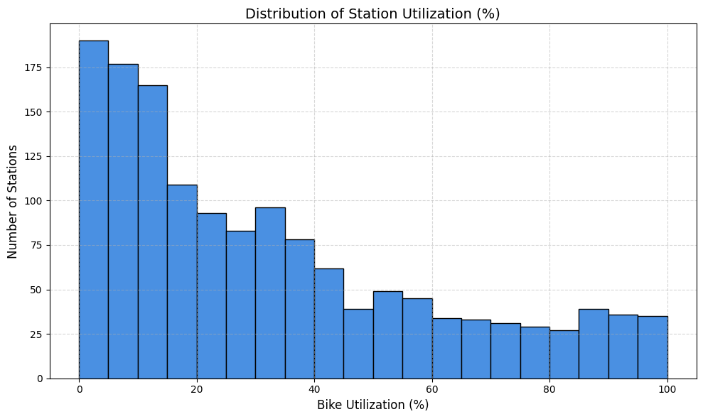
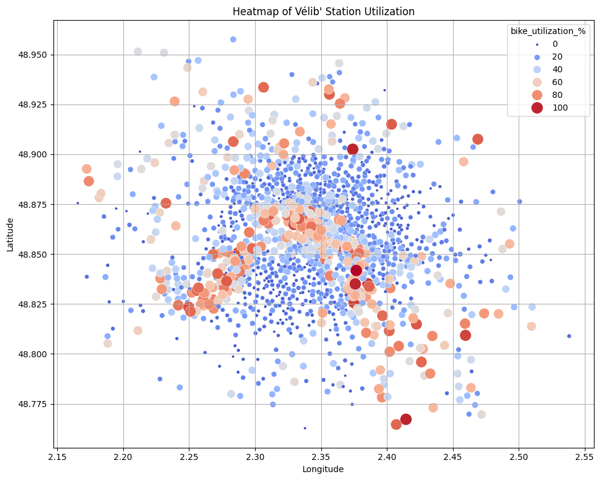
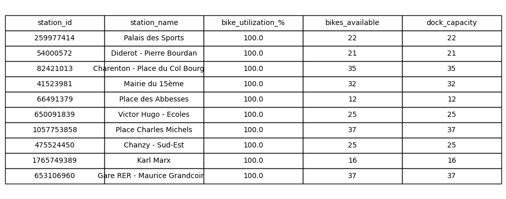

# Vélib' Métropole – Real-time Bike & Dock Availability

[](https://www.python.org/)
[](https://jupyter.org/)
[](https://opensource.org/licenses/MIT)

---

## Project Overview

This Jupyter notebook pulls **live data** from the official **Vélib' Métropole GBFS API** (provided by Smovengo) and turns it into actionable insights:

* **Station status** – bikes available, docks free, renting/returning flags  
* **Station information** – name, coordinates, total capacity  
* **Enriched DataFrame** – merges status + info for full context  

The notebook then **visualises** the data with **Matplotlib / Seaborn** and **Folium** (interactive map).

---

## Data Sources

| Endpoint | Content |
|----------|---------|
| `station_status.json` | Real-time `numBikesAvailable`, `numDocksAvailable`, `is_renting`, `is_returning` |
| `station_information.json` | `station_id`, `name`, `lat`, `lon`, `capacity` |

> Data updates **every ~1 minute**.

---

## Requirements

```bash
pip install pandas requests matplotlib seaborn folium
```

---

## How to Run

```bash
git clone https://github.com/mah6od/velib-metropole-analysis.git
cd velib-metropole-analysis
jupyter notebook Vélib'_Métropole.ipynb
```

Run **all cells** – the notebook will:

1. Fetch the latest JSON payloads  
2. Build a clean `DataFrame`  
3. Compute derived metrics (`occupancy_rate`, `free_rate`)  
4. Produce **4 visualisations** (see below)  
5. Export the map as `velib_map.html`

---

## Key Results & Plots

### 1. Snapshot of the first 10 stations

```plaintext
   station_id  numBikesAvailable  numDocksAvailable  is_renting  is_returning
0   213688169                  6                 29           1             1
1 19179944124                 10                 18           1             1
2       36255                  2                 19           1             1
...
```

*All stations are **renting** and **accepting returns** (`1`).*

---

### 2. Distribution of Bike & Dock Availability  



* **Bikes**: mostly **0-10** available per station (many stations low on bikes).  
* **Docks**: broader spread, peaking around **15-30** free docks.

---

### 3. Occupancy Heat-map (station-level)



* Darker red = **high occupancy** (few free docks).  
* Darker blue = **many free docks**.

---

### 4. Top-10 Stations by Available Bikes



---

## Derived Metrics (added in the notebook)

| Column | Formula |
|-------|---------|
| `total_capacity` | `numBikesAvailable + numDocksAvailable` |
| `occupancy_rate` | `numBikesAvailable / total_capacity` |
| `free_rate`      | `numDocksAvailable / total_capacity` |

```python
df['occupancy_rate'] = df['numBikesAvailable'] / (df['numBikesAvailable'] + df['numDocksAvailable'])
```

---

## Extending the Analysis

| Idea | Library | One-liner |
|------|---------|-----------|
| Time-series (historical files) | `pandas` + `plotly` | `px.line(df_ts, x='timestamp', y='numBikesAvailable')` |
| Predictive model (next-hour bikes) | `scikit-learn` | `RandomForestRegressor` |
| Dashboard | `streamlit` | `st.map(df)` |
| Alerts (low-bike stations) | `smtplib` / `telebot` | Send email/Telegram when `numBikesAvailable < 2` |

---

## Folder Structure

```
├── Vélib'_Métropole.ipynb      # main notebook
├── results/
│   ├── bike_dock_hist.png
│   ├── occupancy_heatmap.png
│   ├── top10_bikes.png
├── README.md
└── requirements.txt
```

---

## License

**MIT** – feel free to fork, modify, and share.

---

> **Happy biking & happy coding!**
